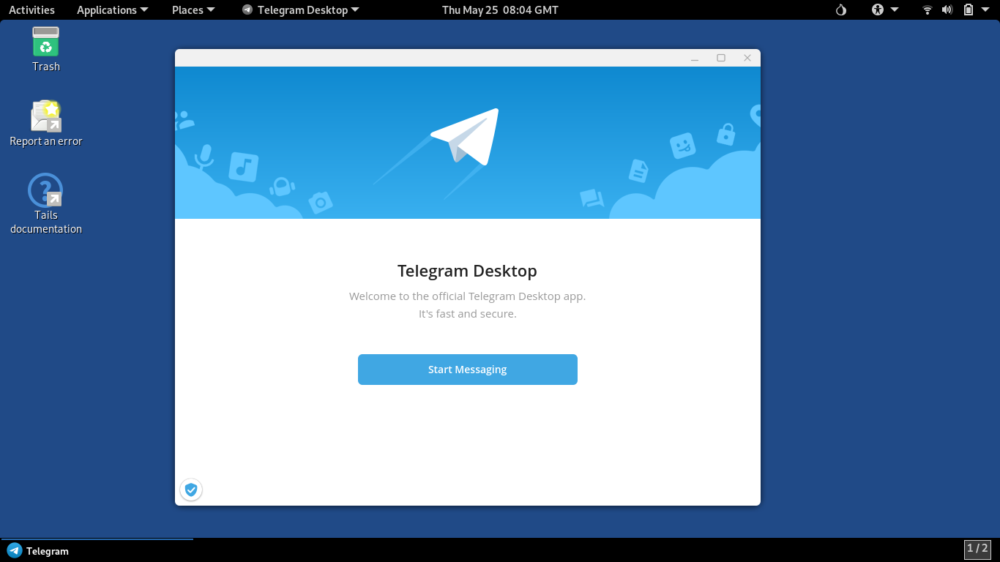

## Telegram Desktop Messenger
{: .no_toc }

## Table of contents
{: .no_toc .text-delta }

1. TOC
{:toc}

---
### Overview

[Telegram](https://telegram.org/){:target="_blank" rel="noopener"} is an instant messaging app providing voice, video, and text communications, along with secure end-to-end encrypted messaging, file sharing, and a variety of community features like groups and channels.




{: .highlight }
For privacy, the application's configuration is not persistent and resets with every Tails reboot.<br> 
As a result, after each reboot you must set the proxy server and link Telegram to your account.<br>
Although possible, the process for setting up a persistent configuration isn't covered in this instruction.

---
### Install Telegram

* Make sure **Flatpak** has been installed. See [Flatpak](../Futils/flatpak.html)).


* Open a _Terminal_ window:  choose **Applications ▸ Utilities ▸ Terminal**


* Install Telegram:
  ```shell
  $ app_id="org.telegram.desktop"
  $ torsocks flatpak install flathub $app_id
  ```


* Create persistent Telegram application directory:
  ```shell
  $ persistence_dir=/live/persistence/TailsData_unlocked
  $ sudo mkdir -p $persistence_dir/$app_id
  $ sudo chown -R amnesia:amnesia $persistence_dir/$app_id
  $ chmod 700 $persistence_dir/$app_id 
  ```

---
### Create desktop menu item

* Copy application .desktop file to persistent local directory, which serves as a menu item:
  ```shell
  $ $persistence_dir/flatpak/utils/flatpak-menu-item-copy.sh $app_id
  ```


* Update `Icon` entry of the .desktop file:
  ```shell
  $ $persistence_dir/flatpak/utils/flatpak-menu-item-update-icon.sh $app_id
  ```


* Update `Exec` entry of the .desktop file:
  ```shell
  $ $persistence_dir/flatpak/utils/flatpak-menu-item-update-exec.sh $app_id
  ```


* Update .desktop file for compatibility with Tails OS:
  ```shell
  $ persistent_desktop_file="$persistence_dir/dotfiles/.local/share/applications/$app_id.desktop"
  $ desktop-file-edit --remove-key="SingleMainWindow" $persistent_desktop_file
  $ desktop-file-edit --remove-category="Network" $persistent_desktop_file 
  ```


* Force GNOME to recognize a change in the .desktop file to display the menu item:
  ```shell
  $ local_desktop_dir="/home/amnesia/.local/share/applications"
  $ mv "$local_desktop_dir/$app_id.desktop" "$local_desktop_dir/$app_id.temp.desktop"
  $ mv "$local_desktop_dir/$app_id.temp.desktop" "$local_desktop_dir/$app_id.desktop"
  ```

---
### Start Telegram

* Choose **Applications ▸ Other ▸ Telegram**


* Set Proxy server:
  * Wait for _Telegram Desktop_ welcome window to appear
  * Click on the spinning icon in the bottom-left corner of the welcome window
  * Choose **Use custom proxy**
  * Enter Hostname `127.0.0.1`, port `9050`, and then click **Save**
  * Wait for "**SOCKS5** 127.0.0.1:9050" to become online, then click **Close**
  * Click **Start Messaging**
  
---

### For the Future: Update Telegram

* Open a _Terminal_ window:  choose **Applications ▸ Utilities ▸ Terminal**


* Update the application:
  ```shell
  $ torsocks flatpak update org.telegram.desktop
  ```

 
---

### Remove Telegram

* Open a _Terminal_ window:  choose **Applications ▸ Utilities ▸ Terminal**


* Remove the application:
  ```shell
  $ torsocks flatpak uninstall org.telegram.desktop
  ```


* Remove unused runtimes and SDK extensions:
  ```shell
  $ torsocks flatpak uninstall --unused
  ```
  

* Remove .desktop files representing the menu item:
  ```shell
  $ persistence_dir=/live/persistence/TailsData_unlocked
  $ rm $persistence_dir/dotfiles/.local/share/applications/org.telegram.desktop
  $ rm /home/amnesia/.local/share/applications/org.telegram.desktop
  ```


* Remove Telegram utils files:
  ```shell
  $ sudo rm -fr $persistence_dir/org.telegram.desktop
  ```

--- 
