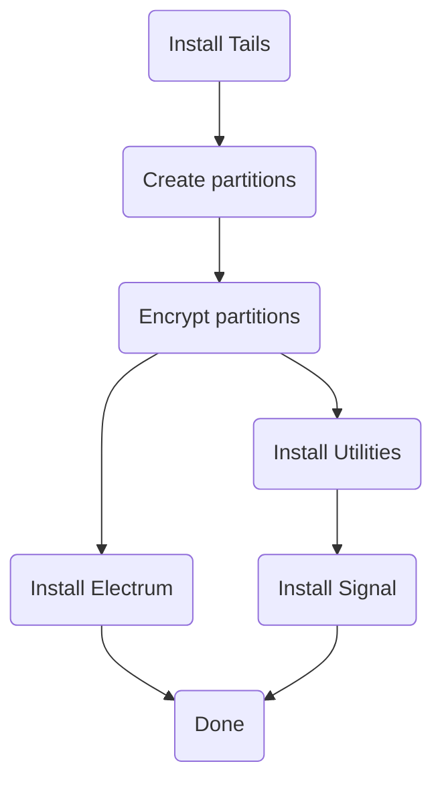

# Install and Configure

This guide explains how to setup your USB memory drive to use it as a bootable USB drive and as an encrypted drive to store securely your personal data.

```mermaid
graph TB;
  B(Install Tails)-->C(Create partitions);
  C(Create partitions)-->D(Encrypt partitions);
  D(Encrypt partitions)-->F(Install Electrum);
  D(Encrypt partitions)-->G(Install Utilities);
  G(Install Utilities)-->H(Install Signal);
  F(Install Electrum)-->Z(Done);
  H(Install Signal)-->Z(Done);
```