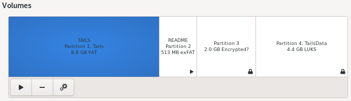

# Partitions

## Configuration

We partition the USB memory stick to have the following structure:

1. **`TAILS`** - partition where the Tail has been installed.
2. **`README`** - 512MB exFAT partition - unencrypted partition, can be used to store insensitive data.
3. **`VeraCrypt`** - 2GB exFAT partition - encrypted with VeraCrypt, should be used to store private files.
4. **`TailsData`** - encrypted Tail Persistent Storage, used for some Tails OS settings and additional software, can also be used to store private files.

{: .highlight }

> The size of the Partitions 2-4 can be adjusted when created. Values above are proposed settings.

---

Next:  [Create partition >>](partitions_create.html)

