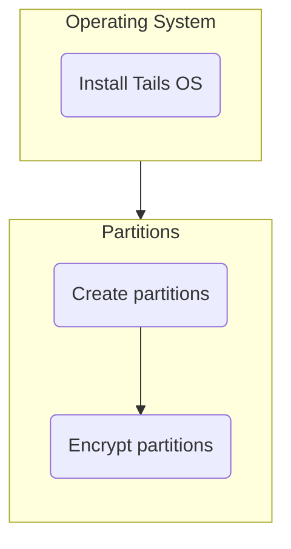

# System Preparation

This guide explains how to set-up your USB memory drive to use it as a bootable USB drive and as an encrypted drive to securely store your personal data.

```mermaid
flowchart TB
subgraph tails [Operating System]
  direction TB
  A(Install Tails OS)
end
subgraph partitions [Partitions]
  direction TB
  B(Create partitions)-->C(Encrypt partitions)
end
tails-->partitions
```

