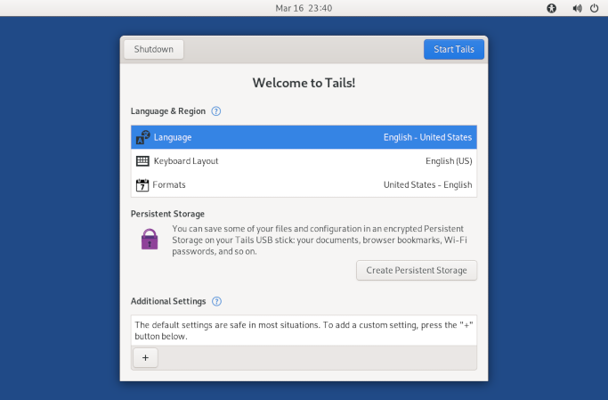

## Partitions
{: .no_toc }

## Table of contents
{: .no_toc .text-delta }

1. TOC
{:toc}

---
### Overview

We partition the USB memory stick to have the following structure:


1. `TAILS` - partition where Tails is installed.
2. `README` - 512MB exFAT partition - unencrypted partition, can be used to store insensitive data.
3. `VeraCrypt` - 4GB exFAT partition - encrypted with VeraCrypt, should be used to store private files.
4. `TailsData` - encrypted Tails Persistent Storage, used for some persistent Tails OS settings and additional software, can also be used to store private files.


{: .highlight }

> The size of the Partitions 2-4 can be adjusted when created. Values above are proposed settings.

---
### Create partitions

* Boot to Tails from the USB stick. After one or to minutes **Welcome to Tails!** screen appears.
 
  


* Set admin password:
    * Click **+** under **Additional Settings**
    * Click **Administration Password**
    * enter a password and confirm it
    * click **Add**


* Start Tails:
    * Click **Start Tails**


* Start **Disks** application:
    * Choose **Applications ▸ Utilities ▸ Disks**


* Select the USB flash drive on the left panel.


* Create the `README` partition:
    * Click **Free Space**, then **+**, set **Partition Size** to `512 MB`, click **Next**
    * Set **Volume Name** to `README`, select **Other**, click **Next**
    * Select **exFAT** and, finally, click **Create**


* Create `VeraCrypt` partition:
    * Click **Free Space**, then **+**, set **Partition Size** to `2048 MB`, click **Next**
    * Set **Volume Name** to `VeraCrypt`, select **Other**, click **Next**
    * Select **exFAT** and, finally, click **Create**


* Close _Disks_ application


---
### Create and encrypt the Persistent Storage

> Tails Persistent Storage will be created on the remaining free space on the usb drive.


* Choose **Application ▸ Tails ▸ Persistent Storage**.


* Click **Continue**.


* Specify a passphrase of your choice in both the **Passphrase** and **Confirm** text boxes, then click **Create Persistent Storage**.
  
  {: .warning }
  > It is impossible to recover your passphrase if you forget it!


* Wait for the creation to finish.


* Wait for the list of features of the Persistent Storage to appear.
  Each feature corresponds to a set of files or settings that can be saved in the Persistent Storage.


* Turn on the following features, at minimum:
    - [x] Persistent Folder
    - [x] Welcome Screen
    - [x] Electrum Bitcoin Wallet
    - [x] Additional Software
    - [x] Dotfiles
  
    > You can turn on more features later on according to your needs


* Close **Persistent Storage** window.

---
### Encrypt VeraCrypt partition

* Mount the `VeraCrypt` partition:
  * Choose **Applications ▸ Utilities ▸ Disks** to start _Disks_ application
  * select the USB flash drive, click **VeraCrypt Partition 3**, click **>** button (Mount selected partition)
  * Close _Disks_ application


* Install VeraCrypt software by following the steps in section [Install VeraCrypt](../apps/veracrypt.html#install-veracrypt).
  > Return to this guide once the steps to install VeraCrypt have been completed.

* Launch VeraCrypt:
  ```shell
  $ ~/VeraCrypt/veracrypt.AppImage
  ```

* Wait for _VeraCrypt_ application to start, and proceed to Encrypt Partition:
    * Click **Volumes ▸ Create New Volume...**
    * Select **Encrypt a non-system partition/drive**, click **Next**
    * Select **Standard VeraCrypt volume**, click **Next**
    * Click **Select Device...**
    * Select the partition that is mounted as `/media/amnesia/VeraCrypt`, then click **OK**
    * Click **Next**, then click **Yes** to encrypt the entire device/partition
    * Enter your Tails admin password, then click **OK**
    * Click **Yes** to continue
    * Keep default **Encrypt Options** and click **Next**
    * Enter a volume password and click **Next**
    * Keep option **No** selected and click **Next**
    * Choose filesystem **exFAT** and click **Next**
    * Select **I will mount the volume on other platforms**, click **Next** and **OK**
    * Move the mouse inside the window to increase randomness, then click **Format** to create the volume and **Yes** to confirm
    * Wait for the volume to be formatted, then click **OK**
    * Click **Exit** to exit the VeraCrypt Volume Creation Wizard
    * Click **Exit** to exit the VeraCrypt

---
### Unlocking VeraCrypt partition

* Set-up and administration password when starting Tails.

* Choose **Places ▸ Computer** to start a _Files_ browser.


* In the left pane, select the partition that corresponds to your VeraCrypt volume


* Enter the parameters to unlock the volume, click **Unlock**.


